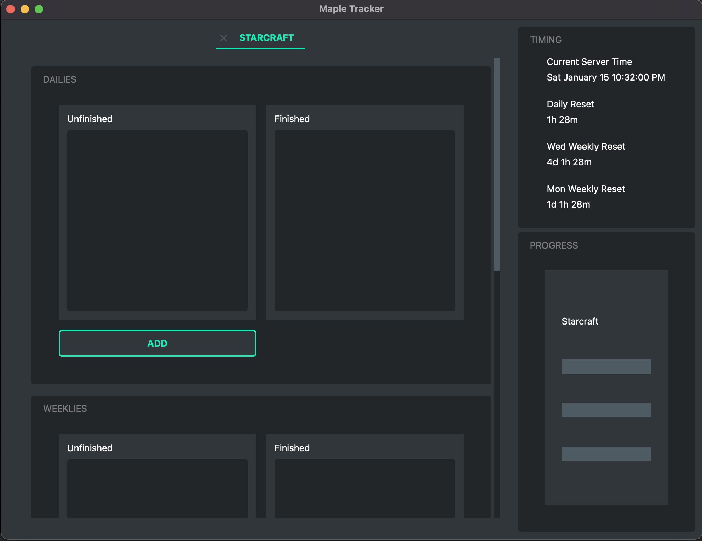

# MapleTracker 

Welcome to the Maple Tracker! This is a tracking application used to keep track of your character and their dailies/weeklies. 

This application will track the reset times appropriately and reset all actions when a reset happens! It also supports temporary actions that will be removed when you specify them (They are in terms of UTC).

This program saves the data to a file when the application is closed. There may be room for auto saving every so often in the future if the need is there. 

---

# Installation
Visit the [release](https://github.com/BryceCallender/MapleTracker/releases) page and find the most recent version

### Windows
1. Download the MapleDailyTrackerWindows.rar file
2. Extract the contents to a location
    a. You can create a folder anywhere
    b. Extract to that folder
3. Run the executable file
4. Pin to taskbar if you want by right click and pin to taskbar
5. Enjoy
### Mac
1. Download the .dmg file
2. Copy the app and place it in the Applications folder in your finder tab
3. Run from there and pin to dock bar if you want!
4. Enjoy
### Linux
1. To be made...

Icon made by [Good Ware](https://www.flaticon.com/authors/good-ware) from [Flaticon](https://www.flaticon.com/)
